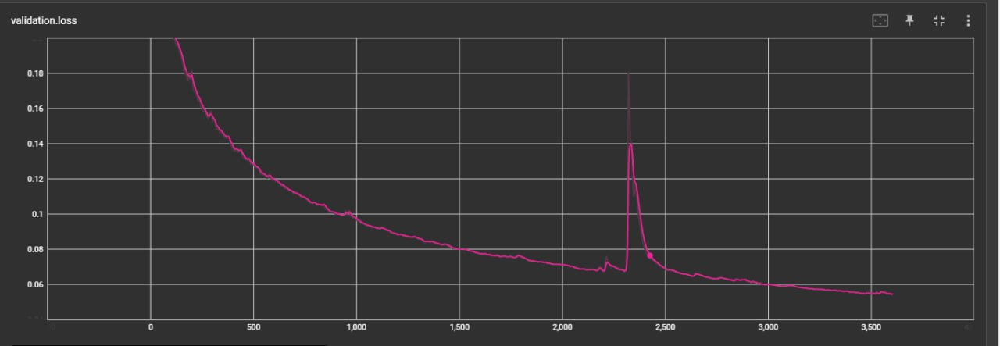
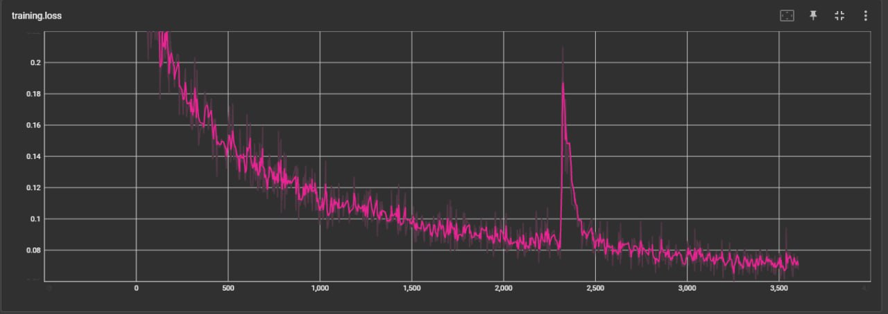
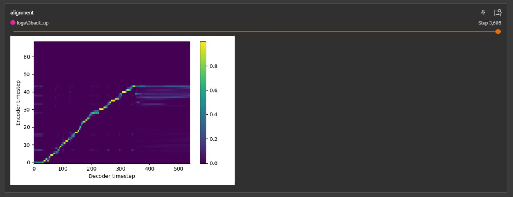
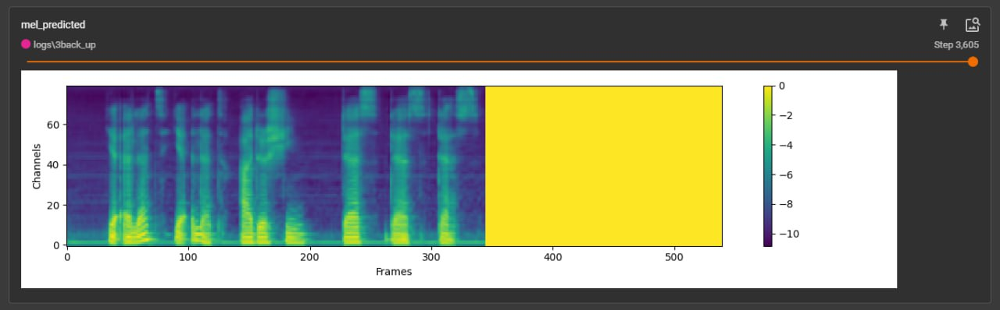

# Amharic **Text-to-Speech (TTS)**

Welcome to <a href="https://www.zemenu.org/">Zemenu's</a>  **Amharic | Text-to-speech** GitHub repository! 
This repository contains the source code and development history of the **Amharic | Text-to-speech** platform.

## Structure

The repository is structured as follows:

- <a href="https://github.com/moanbekele/Text-to-Speech-Amharic/tree/main/Backend/KIYA">backend/</a>  : Here You will find the backend code which includes the endpoint for the restful-API created by Flask, as well as libraries required for the **Text-to-speech** model to work as `Tensorflow`, `Pytorch` and such.

- <a href="https://github.com/moanbekele/Text-to-Speech-Amharic/tree/main/Backend/KIYA">frontend/</a>: Here you will find the frontend code for the **Text-to-Speech** Project, implemented using `Flask` to render the frontend which uses `HTML`, `CSS`, and `JavaScript` files for the user interface.`

- <a href="https://drive.google.com/file/d/1JqxdjuCUNUpH2Nv18Vlx5Z1RTJogSi69/view?usp=sharing">models/</a>: This directory contains the trained Generative AI models used by <a href="https://www.zemenu.org/">Zemenu's</a> team for the **Text-to-speech**. The model is implemented using Python-based AI/ML libraries such as `hifigan` to make the out from the model High Fidelity, and play a crucial roll by synthesizing the audio output.

 
 

## Purpose

This **Text-to-speech** platform is designed for use cases such as generating an audio book from an amharic text book or making automated voice response for certain business by automizing repetative customer support services or for text to speech service for any peronal resons inluding entertaiment purposes.

## How Generative AI Models are Solving the Problem

 <a href="https://www.zemenu.org/">Zemenu's</a>  **Amharic | Text-to-speech** service leverages Generative AI model to create high quality text to speech in amharic for various use cases as listed in the purpose section above.The chosen Generative AI models, such as the <a href="https://drive.google.com/file/d/1JqxdjuCUNUpH2Nv18Vlx5Z1RTJogSi69/view?usp=sharing">Amharic_Text_to_speech_model</a>, have been fine-tuned to synthesize audio by receiving input from user. These models utilize cutting-edge techniques to make the audio output High Fidelity by using a `hifigan` model for the training 

# Installiation 

> ## PIP-Installation
 -  `pip install -r requirements.txt` Install all pip dependencies 

> ## Start Flask App
 -  `python3 app.py` Run Flask app

# Usage
> ## URL's for Input and Output
 - `http://127.0.0.1:5000` Html page which takes input from user and make a POST request to the backend to synthesize audio. 
 - `http://127.0.0.1:5000/tts` Html page which outputs the synthesized audio. 